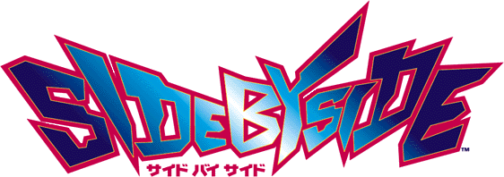

*"No way to let him get ahead of me!"*

The first game in the series, [released in July 1996 in Japan,](https://archive.org/details/ArcadeGameList1971-2005/page/n46/mode/1up?view=theater) with the 2005 edition of *Domestic and Overseas Arcade Game List* [reporting an US release the month prior](https://archive.org/details/ArcadeGameList1971-2005/page/n138/mode/1up?view=theater) - which, if it did saw release there, appeared to be one of the company's few last releases before their American operations shuttered around the same year. (Taito USA's address is still listed in the game's flyer, coincidentally; however, the only known English version of the game was compiled in September 1996.)

The original *Side by Side* is considered one of the rarest games nowadays, as most of them (in original twin cabinet configuration) were seemingly converted to its sequel, [*Side by Side 2 Evoluzione*.](../sidebs/sbs2.md)

- [Official website (Wayback Machine)](https://web.archive.org/web/19970516075330/http://www.taito.co.jp/gm/index.htm)
- [TCRF page](https://tcrf.net/Side_by_Side)
- [Flyer](https://flyers.arcade-museum.com/videogames/show/4549)

!!! note 
    If you are emulating any Taito JC System game in MAME, you should be running version 0.266 with `-cheat` switch and overclock the `maincpu`, `sub`, and `dsp` CPUs to at least 200%. [Properly overclocked, it should run like this.](https://www.youtube.com/watch?v=hY-vNodNSN0) Currently, Taito JC games suffer from a slowdown due to imperfect CPU emulation. [Starting from version 0.267,](https://github.com/mamedev/mame/commit/3d357c07c0ca824868bbe7586839c8caae236571#diff-2fc8ed920c6dc8de6019a9cde02d47e52e622912f49e6e03a5544471103b32d4) changes in Motorola 68000 FPU emulation has made the performance worse, even overclocked.

!!! warning 
    For the first *Side by Side* in particular, if you win a race with overclocked CPU as mentioned above, [MAME can also crash](https://mametesters.org/view.php?id=8852) if you reach the Congratulations screen.

WIP

# Builds

Build Tag | Language/Region | Dump Status | Notes
------ | ------ | ------ | ------ |
`SIDE BY SIDE VER 2.5 J 1996/ 6/20 18:13:14` | Japanese | In MAME (`sidebsjb`) | Earliest Japanese version, added to MAME in version 0.81u4.
`SIDE BY SIDE VER 2.6 J 1996/ 7/ 1 18:41:51` | Japanese | In MAME (`sidebsja`) | Added in MAME in version 0.175.
`SIDE BY SIDE VER 2.7 J 1996/10/11 14:54:10` | Japanese | In MAME (`sidebsj`)  | Added in MAME in version 0.148u3.
`SIDE BY SIDE VER 3.0 OK 1996/ 9/ 2 20:04:19` | English | In MAME (`sidebs`) | English version, added in MAME version 0.263. Built two months before Japanese 2.6 version and a month prior to 2.7. `K` in region tag probably means South Korea ("Overseas + Korea"?) In addition to language, the Savanna and Efini branding on the RX-7s are not used. At least one cabinet is known to exist, at [Deck Amusements, Dymchurch, England, as of 2017.](https://www.youtube.com/watch?v=QVYovNG6Rwo&list=PLltO_kA9MwiEGGwsqOokEdJHAga7kJi2M&index=12&pp=gAQBiAQB)

# Cabinets

WIP

# Cars

See the [SBS1 Cars page.](../sidebs/sbs1.md)

# Tracks

See the [SBS Tracks page.](../sidebs/tracks.md)

!!! tip
    Hold View button after coining up to temporaily unlock the Special course.
