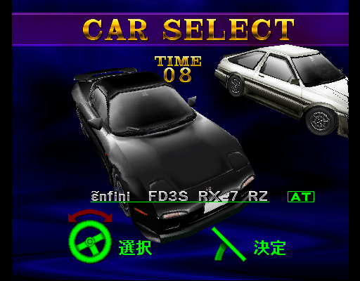

# Side by Side Cars

The following are cars available in the [first *Side by Side*.](../sidebs/sbs1.md) Eight cars from Japan's major automakers are featured, each with two cars per car number class [(3-number and 5-number).](https://en.wikipedia.org/wiki/Vehicle_size_class#Japan)

[Video of the game's attract mode showing car specifications (music added for video purposes)](https://www.youtube.com/watch?v=cmusY-KHMt8)

## Toyota JZA80 Supra RZ

* **Dimension:** 4520mm×1810mm×1275mm
* **Weight:** 1490 kg
* **Engine:** 2JZ-GTE Two-way Twin Turbo
    2997cc
    280PS/5800r.p.m.
    44.0kg.m/3500r.p.m.
* **Drivetrain:** FR
??? note "Notes"
    * Color: Silver Metallic Graphite (changed to Super White II in *Side by Side Special*)
    * Equipped with JGTC-style centerlock wheels and rear license plate garnish (dealer option), the latter removed in *Side by Side Special*.
 
## Nissan R33 Skyline GT-R

* **Dimension:** 4675mm×1780mm×1360mm
* **Weight:** 1530 kg
* **Engine:** RB26DETT DOHC Twin Turbo
     2568cc
     280PS/6800r.p.m.
     37.5kg-m/3500r.p.m.
* **Drivetrain:** 4WD
??? note "Notes"
    * Color: Champion Blue (LM Limited) (changed to Sonic Silver Metallic in *Side by Side Special*, possibly to match car driven by Takayuki Kuroki from *Wangan Midnight*?)
    * Chassis code updated to full form (BCNR33) in *Side by Side Special*. 

## Honda NA1 NSX

* **Dimension:** 4430mm×1810mm×1170mm
* **Weight:** 1350 kg
* **Engine:** C30A V6 VTEC
     2977cc
     280PS/7300r.p.m.
     30.0kg-m/3500r.p.m.
* **Drivetrain:** MR
??? note "Notes"
    * Color: Indy Yellow Pearl
    * Equipped with a three-spoke wheel.
    * "V6" is mispelled as "VG" in the original game's spec sheet, which was fixed for the NA2 NSX in the first *Battle Gear.* For the purpose of this website, the corrected spelling has been included.
 
## Mazda FD3S efini RX-7 RZ

* **Dimension:** 4280mm×1786mm×1230mm
* **Weight:** 1250 kg
* **Engine:** 13B-REW Sequential Twin Turbo
     654×2cc
     265PS/6500r.p.m.
     28.0kg-m/4000r.p.m.
* **Drivetrain:** FR
??? note "Notes"
    * Color: Brilliant Black
    * "Efini" is mispelled as "Enfini" in the car selection screen, and not used in the English version as the badging was used only in Japan.

## Toyota AE86 Trueno GTV

* **Dimension:** 4205mm×1625mm×1335mm
* **Weight:** 940 kg
* **Engine:** 4A-GEU DOHC 4 Valve
     1587cc
     130PS/6600r.p.m.+α
     15.2kg-m/5200r.p.m.+α
* **Drivetrain:** FR
??? note "Notes"
    * Color: High-Tech Two-Tone
    * Equipped with RS Watanabe 8-Spoke wheels.

## Nissan S13 Silvia K's

* **Dimension:** 4470mm×1690mm×1290mm
* **Weight:** 1190 kg
* **Engine:** SR20DET Twin Cam Turbo
     1998cc
     205PS/6000r.p.m.+α
     28.0kg-m/4000r.p.m.+α
* **Drivetrain:** FR
??? note "Notes"
    * Color: Pink (not an Nissan factory color; changed to Super Red in *Side by Side Special*)
    * Equipped with a three-spoke wheel, which was changed to a mesh wheel as used by the 180SX in *Side by Side Special*, and an optional front grill.
    * As the car has an SR20DET engine, the chassis code should be technically "PS13". This was never corrected in *Side by Side Special*.

## Honda EG6 Civic SiR

* **Dimension:** 4070mm×1695mm×1350mm
* **Weight:** 1040 kg
* **Engine:** B16A DOHC VTEC
     1595cc
     170PS/7800r.p.m.+α
     16.0kg-m/7300r.p.m.+α
* **Drivetrain:** FF
??? note "Notes"
    * Color: Samba Green Pearl (not a Honda factory color for EG Civic, but was offered on the Del Sol; loose apparoximation. Color changed to Granada Black Pearl in *Side by Side 2* and to maroon loosely based on Milano Red in *Side by Side Special*.)

## Mazda FC3S Savanna RX-7 ∞

* **Dimension:** 4335mm×1690mm×1270mm
* **Weight:** 1250 kg
* **Engine:** 13BT RE Twin Turbo
     654×2cc
     215PS/6500r.p.m.+α
     27.5kg-m/3500r.p.m.+α
* **Drivetrain:** FR
??? note "Notes"
    * Color: Blaze Red (loose; has orange tone in-game, though in [website/flyer render](https://web.archive.org/web/19970516140013im_/http://www.taito.co.jp/gm/FC_TES.gif) it does have true red shade; changed to Crystal White in *Side by Side 2*.
    * Color likely chosen as a reference to *Top Speed*/*Full Throttle*, Taito's earlier arcade game that starred a (zenki) FC RX-7.  
    * Savanna name not used in the English version, as the car was sold without that moniker outside of Japan. 
