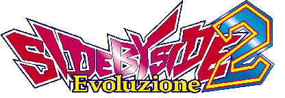

*Nice to see ya again.*

The second game in the series, [releasing in May 1997 in Japan](https://archive.org/details/ArcadeGameList1971-2005/page/n46/mode/1up?view=theater) with the RR update releasing several months later.

- [Official website (Wayback Machine)](https://web.archive.org/web/19971012061831/http://www.taito.co.jp/sbs2/index.html) (please note that car renders and specifications are missing from the archive)
- [TCRF page](https://tcrf.net/Side_by_Side_2)
- [Flyer](../images/etc/sbs2_flyer.jpg) (the one on TAFA is missing inside pages; this is taken from `battlegear.net`)
 
!!! note 
    If you are emulating any Taito JC System game in MAME, you should be running version 0.266 with `-cheat` switch and overclock the `maincpu`, `sub`, and `dsp` CPUs to at least 200%. [Properly overclocked, it should run like this.](https://www.youtube.com/watch?v=BN6cwDzq0fg) Currently, Taito JC games suffer from a slowdown due to imperfect CPU emulation. [Starting from version 0.267,](https://github.com/mamedev/mame/commit/3d357c07c0ca824868bbe7586839c8caae236571#diff-2fc8ed920c6dc8de6019a9cde02d47e52e622912f49e6e03a5544471103b32d4) changes in Motorola 68000 FPU emulation has made the performance worse, even overclocked. It is also recommended to set the master volume in Sound Test to maximum, as the default volume can be very quiet.

WIP

## Builds

Build Tag | Language/Region | Dump Status | Notes
------ | ------ | ------ | ------
Unknown | Japanese, original | Undumped | Earlier builds are known to exist with swapped month labels for the Professional (July) and Ace Driver (October) courses, [as shown on the flyer,](../images/etc/sbs2_flyer.jpg) although they were either location testing or internal use builds. Although this mistake was fixed for all known arcade versions, it was never fixed in any version of *Side by Side Special.*
`SIDE BY SIDE2 VER 2.4 J 1997/ 5/26 3:06:37` | Japanese, original | In MAME (`sidebs2ja`) | Earliest known base Japanese version. This build has the month labels for the July and October tracks in the correct position. Added in MAME version 0.124u2.
`SIDE BY SIDE2 VER 2.6 OK 1997/ 6/ 4 17:27:37` | English | In MAME (`sidebs2`) | International English version; `K` in region tag probably means South Korea ("Overseas + Korea"?) Honda cars are available, but trim badges were removed from them. A cabinet with this ROM has not been spotted in the wild, although PCBs do exist given how it is dumped and present in MAME (since version 0.175).
`SIDE BY SIDE2 VER 2.6 A  1997/ 6/19 09:39:22` | English, US | In MAME (`sidebs2u`)  | US English version with [Honda cars disabled](/docs/other/honda.md) (an issue not mentioned in the flyer) and "Winners Don't Use Drugs"/"Recycle It, Don't Trash It" PSAs. It is unknown how many cabinets were actually distributed with this ROM as the game is not mentioned in the US list of the 2005 edition of *Domestic and Overseas Arcade Game List*, [but PCBs do exist.](https://www.youtube.com/watch?v=RVvNLj7oVek) Added in MAME version 0.81u4; despite the rarity, this version was the first one to be dumped and added to MAME.
`SIDE BY SIDE2 RR VER 3.1 J 1997/10/ 7 13:55:38` | Japanese, RR | In MAME (`sidebs2j`) | *Evoluzione RR* update, only released for the Japanese version. Adds reverse courses (shift when selecting cars) and post-race replays, adjusts shift points for AT users, and more. Most known cabinets are of this revision, either as purchased from an arcade distributor or originally upgraded [through ROM upgrade kit.](https://twitter.com/pooka11509574/status/1239179856727781376/photo/1) Added in MAME version 0.181.

## Cabinets

WIP

## Cars

See the [SBS2 Cars page.](/docs/sidebs/sbs2_car.md)

## Tracks

See the [SBS Tracks page.](/docs/sidebs/tracks.md)

!!! tip
    For non-RR versions only, hold View button after coining up to temporaily unlock the Special course, if the track has not yet been permanently unlocked. (Getting a high score will unlock the track permanently; the track is also unlocked by default in the RR revision.)

## Version Differences

### English Versions

There are two English versions of the game, one with region `OK` (international) and the other with region `A` (US). The `OK` version has Honda cars enabled, but without SiR trim labels. The `A` version has them [disabled](/docs/other/honda.md), with the Legacy and Levin being selectable by default instead. Both versions also have the "Evoluzione" subtitle removed from the game's branding. Note that, in the `A` version where the Honda cars are disabled, the Civic and CR-X logos in the car selection screen is left unchanged.

Otherwise, both are identical to the Japanese non-RR revision. The RR revision does carry one thing from the US English non-RR revision, the different LAN test screen during POST/startup (on original Japanese and international English versions it goes AE86 Levin, AE86 Trueno, CR-X, Civic; in the US English and Japanese RR version, it goes R32 GT-R, FD RX-7, Impreza, and Lancer).

It is unknown how many cabinets are out there with either ROM installed, other than from PCBs where the dumps originate.

### *Side by Side 2 Evoluzione RR*

In late 1997, Taito released an update to the original game in form of [ROM upgrade kit](https://twitter.com/pooka11509574/status/1239179856727781376/photo/1) for owners of the original revision of the game. (It might be also possible that later production runs of the game already have the *RR* update installed, as most installations tend to have the update installed.) Cabinets with the RR update are distinguished with a sticker indicating the new features on the cabinet marquee (*R*everse and *R*eplay), although some cabinets may not have them installed. The game's title screen is also updated with the "RR" letters.

This update adds the following features:

* Reverse courses, selectable by shifting up/down when selecting a track. Lap records for both layouts are also seperated.
* Post-race replays if the player finishes (regardless of finishing position). Pressing the view button will end the replay, while view can be changed by shifting gears.
* The Special/22:00 course is unlocked by default, without need to hold view button after coining up (temporary) or registering a top ranking record (permanent).
* The AE86s (Trueno and Levin) now have six-speed transmission. (This results in the AT/MT indicator no longer being available when driving either, however.)
* CPU difficulty has been adjusted.

## Others

- When in attract demo, pressing the View Change button will change the currently focused car.
