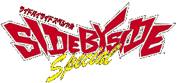

An extended port of *Side by Side 2* for the original PlayStation with cars and tracks from the first *Side by Side* also thrown in. Originally released in December 1997 only in Japan, with a re-release version called *Side by Side Special 2000* (referring to then-forthcoming year of 2000 and its discounted price of 2,000 yen) releasing in late 1999. (The *Arkanoid Returns* port for the same console also received a similar treatment, named *Arkanoid R 2000*.)

- [Official site (*Special 2000*, Wayback Machine)](https://web.archive.org/web/20000127092507/http://www.taito.co.jp/d3/lineup_c/sbs2000.html)
- [TCRF page](https://tcrf.net/Side_by_Side_Special)
- [Fatalita/Minardi_M765's playthrough of both versions](https://www.youtube.com/playlist?list=PLVgzIufESq6S0ytaDzrzhwwrsxVGyWxVp)
  
WIP

## Builds

This game and its arcade counterpart, *Side by Side 2*, appears to be developed simultaneously, as an mistake caught [in an flyer for *Side by Side 2*](../../images/etc/sbs2_flyer.jpg) was present here and never fixed in *Special 2000*.

Product Code | Build Date | Release Date | Title | Notes
------ | ------ | ------ | ------ | ------
`SLPM-80145` | 1997-08-23 | 1997-??-?? | *Side by Side Special Taikenban* | Demo version limited to three cars and two tracks. [TCRF page](https://tcrf.net/Proto:Side_by_Side_Special#Taikenban_Disc)
`SLPS-01150` | 1997-10-30 | 1997-12-18 | *Densha de GO!* | Demo version present in *Densha de GO!*'s Omake menu. Built ten hours *before* the 1997 retail version, judging by its executable (`SBS\SLPS-011.75`). Same as the standalone demo disc but with assets from the final game. _Product code here refers to main *Densha de GO!* disc._ [TCRF page](https://tcrf.net/Proto:Side_by_Side_Special#Densha_de_GO.21_Demo)
`SLPS-01175` | 1997-10-30 | 1997-12-04 | *Side by Side Special* | Initial retail release.
`SLPM-86344` | 1999-08-18 | 1999-11-11 | *Side by Side Special 2000* | Budget re-release with DualShock vibration support added and some other changes (see below). Apart from the executable file, most other files are dated 1997-11-04, just a month prior to the release of the original.

## Cars

See the [SBSS Cars page.](../sidebs/sbss_car.md)

## Tracks

See the [SBS Tracks page.](../sidebs/tracks.md)

## Changes

### Arcade games vs *Special*

- **Bug:** As mentioned earlier, due to the game being developed simulatenously with *Side by Side 2*, the swapped SBS2 July (Professional) and October (Ace Driver) track month label bug is present, much like it did [in an SBS2 flyer.](../../images/etc/sbs2_flyer.jpg) (This error was never fixed in *Special 2000.*)
- Due to PlayStation hardware limitatons, some on-track objects have been removed, most notably the lighthouse in SBS1 Summer track and the fireworks in the SBS2 July (night) track.
- Some of car colors and wheels have been changed from the arcade games (see the cars page).
- Tracks from the first *Side by Side* now has start/checkpoint/finish signs and track maps from *Side by Side 2*. (According to the files in the standalone demo disc build, SBS1 tracks originally would have kept track maps based in style of the original game.)
- Car specifications are not shown during attract mode - only lap leaderboards are shown.

### *Special* vs *Special 2000*

- Support for DualShock has been added, but only for vibrations - analog steering is not supported.
- The *Densha de GO!* trailer ("Information" in main menu) has been removed.
- Default lap records has been adjusted to be harder.
- The starting time limit for the Special course from the first *Side by Side* was made harder.
- The "SIDE BY SIDE SPECIAL" text logo before the Taito logo and the opening movie has been removed.
- If the track has been won in Arcade Mode, the track can be played in reverse by pressing **L1** or **R1**, although only in the Time Attack mode. (Records are shared between normal and reverse layouts.) This feature was a carryover from *Side by Side 2 Evoluzione RR* update, although not restricted to time attacks in the arcade game.
- Some text has been decapitalized (eg "PUSH START BUTTON" becomes "Push START button", as well in options menu)
- Whenever a memory card access occurs, "Memory Card Access" graphic has been replaced with standard "Checking MEMORY CARD" message.
- Two of secret vehicles have their names corrected: **Taito Ban** to **Taito Van** and **Taito Track** to **Taito Truck**.
- If you attempt to restart or quit a race from the pause menu, the game now confirms if you want to do so.
- A credit for Tetsuya Watanabe, with listed car code of NA6, has been added under "2D 3D Graphic Modelling".
- Some text, such as options menu headers and the "READY?" text in the beginning of a race, are now rendered using standard in-game font.
- **Bug:** If you race on a night track, the shading colors of the digital speedometer and gear indicator turns red.
