# Tracks

This page is a list tracks in the *Side by Side* games. Difficulty labels refer to what they are called in the English versions.

!!! note
    - The difficulty labels in the English versions of *Side by Side* games go from Beginner, Expert, Professional, and Ace Driver (plus Special) in that order. In *Side by Side Special*, there is an unused "Normal" difficulty label (along with the also-unused English difficulty labels) in the game's files that would probably softened the difficulty labels, similar to the first *Battle Gear* where it goes Beginner, Intermediate, Expert, and Professional (plus Special and Trial).
    - Course length data is not available, as Taito did not list any of it.

## Side by Side

The first *Side by Side* tracks are themed after seasons (with kanji to match), a theme that would re-emerge in the first *Battle Gear*.

!!! note
    In-game music cannot be changed in the original *Side by Side*.

### Spring / Beginner

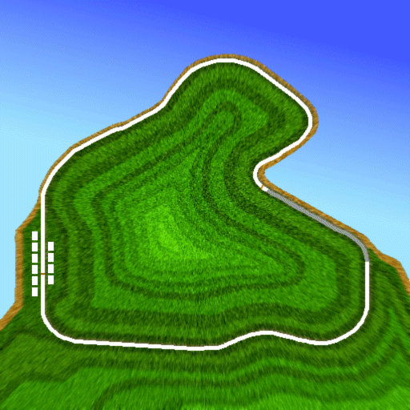

* Japanese name: 初級 -春- (Sho-kyu -Haru-)
* Default music: Blue Wind (SBS1)/Theme of Spring (SBSS)

A fast track suitable for all players, set in the valleys with sakura leaves on the backstraight.

### Summer / Expert

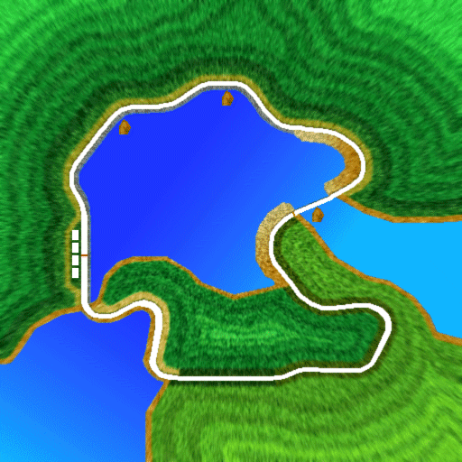

* Japanese name: 中級 -夏- (Chu-kyu -Natsu-)
* Default music: Blue Wind (SBS1)/Thawing (SBSS)

A intermediate track set in a coastal area, with rally-esque gravel segment in the latter half of the track providing a surprise and challenge. (Note that the original *Side by Side* did not have 4WD rally machines, but *Side by Side Special* does.)

The arcade version of the track has a lighthouse early in the track, which was removed in *Side by Side Special*.

### Autumn / Professional

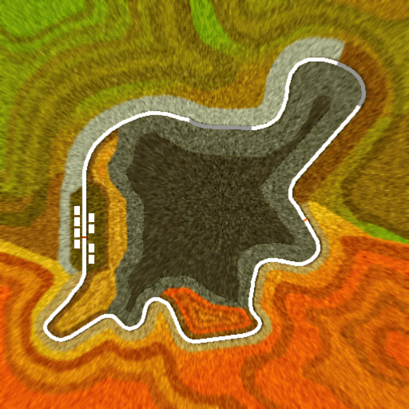

* Japanese name: 上級 -秋- (Jo-kyu -Aki-)
* Default music: Red Road (SBS1)/Red Leaves (SBSS)

Where things go harder, this mountainous track features narrow roads that can make passing a challenge.

### Winter / Ace Driver

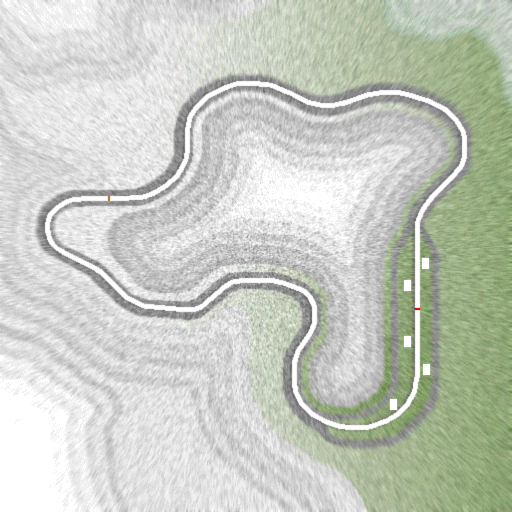

* Japanese name: 超上級 -冬- (Chojo-kyu -Fuyu-)
* Default music: Red Road (SBS1)/Thawing (SBSS)

The hardest track in the first *Side by Side*, but clearly the easist out of all "super advanced" tracks in the series. This snow-filled track requires mastery of rally-style driving; stylish power slides may be tempting to do given the low traction, but too much focus on that can waste precious time required to succeeed in this track.

### Special

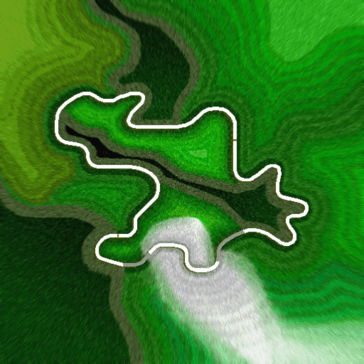

* Japanese name: 弩級 -春- (Ishiyumi-kyu -Kyoku-)
 * In English, this translates to Dreadnought -Extreme-. 
* Default music: Blue Wind (SBS1)/Thawing (SBSS)
* *Hold the view button after the screen blacks out after coining up to unlock this track.* (This track is available by default in *Side by Side Special*.)

The only "dreadnought" course in the *Side by Side*/*Battle Gear* series to be a circuit course, this track requires mastery of all you have knew so far in playing this game, with varied (mostly narrow) road widths and multiple surfaces from all four courses featured.

## Side by Side 2 Evoluzione

The tracks in *Side by Side 2 Evoluzione* are named after traditional Japanese names for months (and time, as per [traditional Japanese clock](https://en.wikipedia.org/wiki/Japanese_clock)). This pattern also applies to the three bonus tracks in *Side by Side Special*.

!!! note
    There is a bug in *Side by Side Special* (and in early builds of *Side by Side 2* as shown on the game's flyer) where the month labels for the Professional and Ace Driver courses are switched around. This website uses the correct order as used in the final version of *Side by Side 2* when referring to the two affected tracks.

### April / Beginner

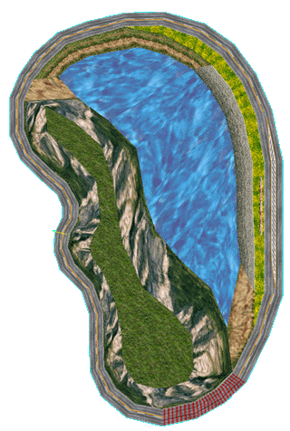

* Japanese name: 初級 -卯月- (Sho-kyu -Uzuki-)
* Default music: Theme of Spring

A high-speed semi-oval based on Lake Akina. Speed is *almost* everything here, but the getting the line right in the final turn is equally important.

There is a reference not only to a certain tofu shop, but also to a certain bicycle repair shop, on this track.

### March / Expert

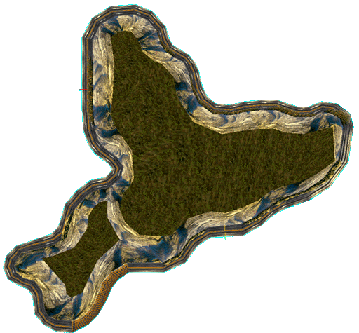

* Japanese name: 中級 -弥生- (Chu-kyu -Yayoi-)
* Default music: Thawing

Based on Usui during the sunset of a late winter, ready to transition to spring. There are snowy gutters after the exit of the tunnel that may be time-wasting or beneficial, depending on your driving style.

### July / Professional

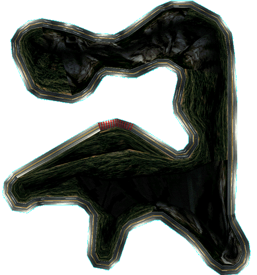

* Japanese name: 上級 -文月- (Jo-kyu -Fumizuki-)
* Default music: Midnight

The first night track in the series. Twisty yet fast at the same time, mastery of drifting is important here.

In the arcade game, there are fireworks as the player crosses the bridge. The fireworks are absent in *Side by Side Special*.

### October / Ace Driver

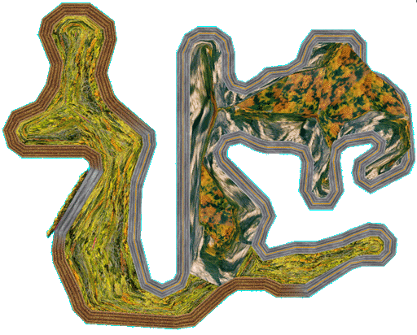

* Japanese name: 超上級 -神無月- (Chojo-kyu -Kannazuki-)
* Default music: Red Leaves

Based on Myogi, this track is probably one of the hardest circuit course in the series. With long distance (enough for the track to run with less laps compared to the other "circuit" tracks), twisty turns, and even grip=reducing gravel sections, mastering this track will get you prepared for the Special course.

### 22:00 / Special

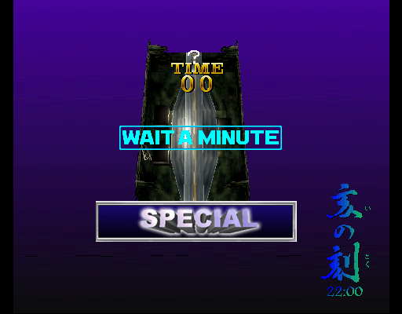

* Japanese name: 超弩級 -亥の刻- (Chodo-kyu -I no Koku-; in English, this translates to Super Dreadnought -Time of the Boar-. In traditional Japanese timekeeping, boar symbolizes late evenings, from 10 pm to midnight).
* Default music: Midnight
* *Hold the view button after the screen blacks out after coining up to unlock this track temporaily; set a record in the leaderboards to unlock this track permanently.* (This track is already unlocked by default in *Side by Side 2 Evoluzione RR* update and in *Side by Side Special*; however if the track is already unlocked in SBS2, the track selection will be focused to this track by default.)
* *As this is a point-to-point course, no track map will be shown during the race.*

The first point-to-point touge course in the series, based on Akina/Haruna. There is no map to help you here (at least, not until English versions of *Battle Gear 2*), so memorization of the layout is equally as important as using everything you have learned so far from playing the game.

For the arcade version of the track, the opponents here feature [special tuning and wheels not accessible to the player,](../sbs2_car.md#special2200-course-tuned-cars) the former to emphasize the difficulty.

Winning on this track will play the ending credits.

## Side by Side Special

*Side by Side Special* includes all ten tracks from both arcade games, plus three new original, "super dreadnought" (超弩級; chodo-kyu) tracks as each of the existing tracks are beaten.

As with the 22:00 track from SBS2, due to the point-to-point nature of these tracks, no track maps are shown.

### June / Original 1

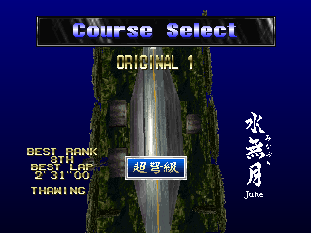

* Japanese name: 超弩級 -水無月- (Chodo-kyu -Minazuki-)
* Default music: Thawing
* *Unlocked by winning in at least six previously unlocked tracks.*

The only daytime "original" track in the game, this track is based on the northern portion of Akagi (Route 251 Numata-Akagi Line).

Winning at this track will unlock the Taito Van.

### 0:00 / Original 2

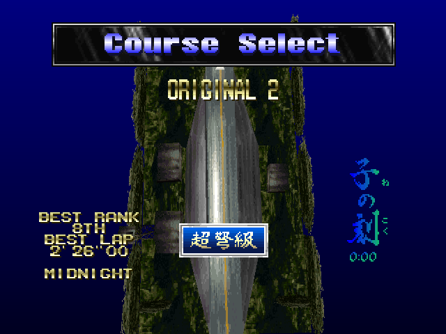

* Japanese name: 超弩級 -子の刻- (Ishiyumi-kyu -Ne no Koku-; in English, this translates to Super Dreadnought -Time of the Rat-. In traditional Japanese timekeeping, rat symbolizes midnight, from 12 am to 1 am)
* Default music: Midnight
* *Unlocked by winning in at least eight previously unlocked tracks.*

Based on the south Akagi (Route 4 Maebashi-Akagi Line) made famous by *Initial D*, this track would later appear in *Battle Gear 2* as the "advanced" course, and as one of the dreadnought tracks in *Battle Gear 3* and *Battle Gear 4*.

Winning at this track will unlock the Taito 1BOX.

### 2:00 / Original 3

* Japanese name: 超弩級 -丑の刻- (Ishiyumi-kyu -Ushi no Koku-; in English, this translates to Super Dreadnought -Time of the Ox-. In traditional Japanese timekeeping, ox/bullock symbolizes the time between midnight and before dawn, between 2 am to 4 am).
* Default music: Midnight
* *Unlocked by winning in at least ten previously unlocked tracks.* (Generally, this means all the main tracks; however since the other two original tracks are unlocked at that point, beating them while skipping two regular tracks may also work.)

Believed to be based on the Gunma Prefectural Route 62 (part of the Akagi mountain roads), this is a deceivingly fast track for a point-to-point touge course, with a time limit that probably won't help the difficulty. If you don't finish in the lead, you will see opponents parking their car at the finish line's parking spot.

Winning at this track will unlock the Taito Truck.
